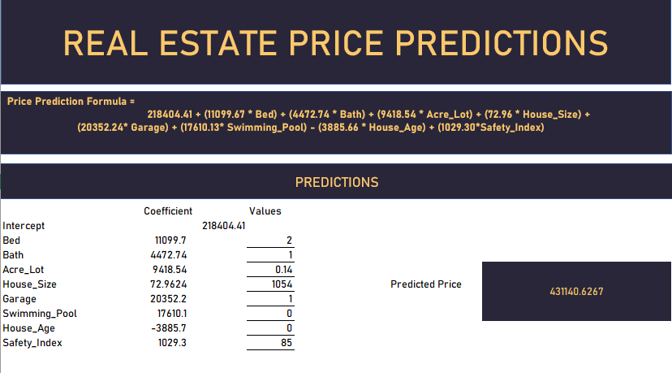

# Real-Estate-Price-Prediction

## Table of Contents
- [Project Overview](#project-overview)
- [Problem Statement](#problem-statement)
- [Project Objective](#project-objective)
- [Data Sources](#data-sources)
- [Data processing](#data-processing)
- [Price Prediction Calculator](#Prediction-Calculator)
- [Key Insights](#key-insights)
- [Conclusion](#conclusion)

- ## Project Overview
RealEstate Bud, a prominent real estate company in Manila, was grappling with a critical challenge: "the accurate valuation of properties in a rapidly evolving market". Manila's property values were influenced by a myriad of factors such as urban development projects, local ordinances, and buyer preferences, which were changing at an unprecedented pace. RealEstate Bud needed to develop a robust and adaptive valuation model to accurately predict property values despite the dynamic nature of the real estate market. 

## Problem Statement
- RealEstateBud faces a critical challenge in accurately valuating properties in the ever evolving real estate market of Manila
- This inaccurate valuations can lead to either missed opportunities for clients or overpriced listings that remain stagnant in the market.

## Project Objective
The primary goal is to create a robust valuation model utilizing Multiple Linear Regression using excel, incorporating a number of factors. This model aims to significantly enhance the accuracy and transparency of property valuations, bridging the gap between estimated and actual property values.

## Data Sources
The dataset used in this project was provided by 10Alytics. The dataset contains Bed, Bath, Acre_Lot, House_Size, Garage, Swimming_Pool, House_Age, Safety_Index

## Data processing
In the process of handling the data, I engaged in compilation and cleansing activities. I systematically examined the dataset to identify and eliminate any duplicate entries. Additionally, I implemented a descriptive statistics of the property price to check the mean, standard devation, median, mode, skewness, min , max and range. Computed correlation matrix to understand relationships between variables and identify multicollinearity issues. Used scatter plots, histograms, and box plots to visualize distributions and relationships. Selected appropriate input range for the dependent and independent variables.Performed regression analysis using the Data Analysis Toolpak and Extracted key metrics such as coefficients, R-Square, Adjusted R-Square, p-values, and confidence intervals from the regression output. Through the utilization of the "IF"and "ISBLANK" function, I developed prediction calculator for prediction prices.

## Real Estate price Prediction Calculator

Predictions 1a     |  Predictions 1b
:-------------:|:--------------:
 | 

## key Metrics
### Correlation matrix
- Intercept 218,404.42
- The price of a property is most strongly influenced by the house size, number of bathrooms, and presence of a garage. The age of the house negatively impacts the price, while safety, the presence of a swimming pool, and lot size have a positive but less pronounced effect.
### Regression statistics
- The regression model exhibits strong predictive power, with a high Multiple R (0.90), R Square (0.816), and Adjusted R Square ()0.812, indicating that it explains a significant portion of the variance in property prices.
- The standard error(27960.97), while providing a measure of the prediction error, should be evaluated in the context of the price range of the properties being studied. With 400 observations, the model is based on a solid dataset, further supporting its reliability. This suggests that the model developed by RealEstateBud using Excel's linear regression capabilities is effective in predicting property values in Manila's dynamic real estate market.
### Regression Output
- Significant predictors (p-value < 0.05): Bed, Acre_Lot, House_Size, Garage, Swimming_Pool, House_Age, Safety_Index.
- Insignificant predictor (p-value > 0.05): Bath
- The coefficients indicate the direction and magnitude of the relationship between each independent variable and the dependent variable (price).

## Conclusion
The model's predictors explain a significant portion of the variation in property prices, making it a useful tool for valuation in the dynamic real estate market of Manila.

  
